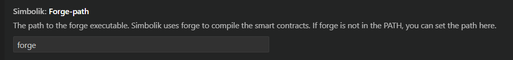
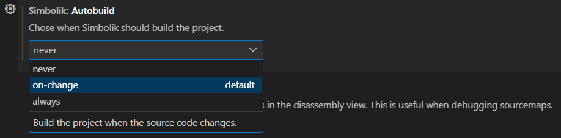

# Compilation

Simbolik automatically compiles your project when you click the `▷ Debug` button.  
For many projects, the default behavior just works out of the box.  

However, if your project requires custom compilation settings, takes too long to compile, or automatic compilation fails, Simbolik also supports manual compilation.

---

## Automatic Compilation

Simbolik uses **Foundry** to compile your project. At the moment, other compilation frameworks are not supported.

### Choosing the Right `forge` Binary

Simbolik uses the `forge` binary available in your system’s `$PATH`.  
Note that the `$PATH` available to Simbolik may differ from the one in your terminal, since Simbolik runs inside a VSCode-managed environment.

To avoid surprises, you can explicitly set the path to your `forge` binary in the extension settings:

<figure><figcaption></figcaption></figure>

### Which `foundry.toml` and Profile Are Used?

Simbolik uses the first `foundry.toml` it finds relative to the currently open file.  
It always compiles using the `default` profile — other profiles are not supported at this time.

### What Compiler Settings Does Simbolik Use?

To make sure the debugger works reliably, Simbolik overrides certain compiler settings. The command it runs looks like this:

```bash
FOUNDRY_OPTIMIZER='false'
FOUNDRY_BUILD_INFO='true'
FOUNDRY_EXTRA_OUTPUT='["storageLayout", "evm.bytecode.generatedSources", "evm.bytecode.functionDebugData", "evm.deployedBytecode.functionDebugData", "evm.deployedBytecode.immutableReferences"]'
FOUNDRY_BYTECODE_HASH='ipfs'
FOUNDRY_CBOR_METADATA='true'
FOUNDRY_FORCE='true'
FOUNDRY_USE_LITERAL_CONTENT='false'
forge build
```

---

## Manual Compilation

### When Should You Compile Manually?

Manual compilation might be a better fit if:

- Simbolik’s auto-compilation conflicts with your workflow
- Auto-compilation fails for your project
- Compilation takes too long
- You need to use a profile other than `default`

### How to Disable Automatic Compilation

To turn off automatic compilation, open the extension settings and set the `autobuild` option to `never`.

<figure><figcaption></figcaption></figure>

Other options include:

- `always`: recompiles every time you click `▷ Debug`
- `on-change` (default): recompiles only when source files are modified in VSCode

> Note: Simbolik doesn’t detect changes made outside VSCode (like changes via Git or a terminal). In such cases, you’ll need to run `forge clean` followed by `forge build` manually.

### What to Keep in Mind When Compiling Manually

When you compile manually, it’s up to you to ensure the output is compatible with Simbolik.  
If you enable the optimizer or omit required debug outputs, the debugger may not work correctly.

Your `foundry.toml` should include these settings:

```toml
optimizer = false
build_info = true
extra_outputs = ["storageLayout", "evm.bytecode.generatedSources", "evm.bytecode.functionDebugData", "evm.deployedBytecode.functionDebugData", "evm.deployedBytecode.immutableReferences"]
bytecode_hash = "ipfs"
cbor_metadata = true
use_literal_content = false
```

You’re also responsible for recompiling after any source code changes.  
Simbolik works best when all contracts are built in one go — incremental builds can sometimes cause unexpected behavior.  
If things seem off, try running:

```bash
forge clean
forge build
```
